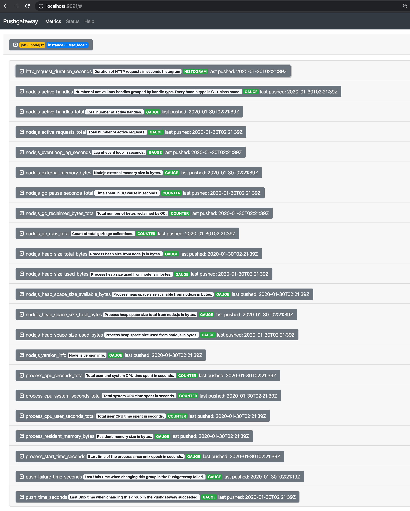

# All metrics collected scraped and pushed

See the content of [./metrics.js](./metrics.js)
```js
const url = require('url')
const os = require('os')
const Prometheus = require('prom-client')
const gcStats = require('prometheus-gc-stats')

const promRegister = Prometheus.register

// Default metrics
const collectDefaultMetrics = Prometheus.collectDefaultMetrics
// timestamp its not remove from all metrics
collectDefaultMetrics({ timestamps: false })

// Garbage Collection metrics
const startGcStats = gcStats(promRegister)
startGcStats()

// push metrics to prometheus gateway every 5 seconds
const gateway = new Prometheus.Pushgateway('http://localhost:9091', {}, promRegister)
const hostname = os.hostname()


setInterval((app) => {
  console.log('pushing metrics...')
  gateway.pushAdd({ jobName: 'nodejs', groupings: { instance: hostname } }, function (err, resp, body) { })
}, 5000)


// histogram for http requests on the web server
const httpRequestHistogram = new Prometheus.Histogram({
  name: 'http_request_duration_seconds',
  help: 'Duration of HTTP requests in seconds histogram',
  labelNames: ['code', 'handler', 'method'],
  buckets: [0.025, 0.05, 0.1, 0.15, 0.2, 0.25, 0.3, 0.35, 0.45, 0.5, 0.55, 0.6, 0.75, 1, 2.5]
})

module.exports = (app) => {
  // expose metrics to be scrape
  app.get('/metrics', (req, res, next) => {
    res.set('Content-Type', promRegister.contentType)
    res.end(promRegister.metrics())
  })
  app.use(httpResponseMiddleware)
}

const httpResponseMiddleware = (req, res, next) => {
  const path = url.parse(req.url).pathname
  res.histogramEnd = httpRequestHistogram.startTimer({
    method: req.method,
    handler: path
  })
  res.on('finish', () => {
    res.histogramEnd({
      code: res.statusCode
    })
  })
  next()
}
```

In a new terminal start the Prometheus gateway.
```bash
docker pull prom/pushgateway
```

```bash
docker run --rm -p 9091:9091 prom/pushgateway
```

Start the application
```bash
npm install
```

```bash
npm start
```

The web server will push the metrics every 5 seconds as configured in the code.

You can access the metrics from the gateway using http://localhost:9091/metrics

Metrics are also available via scrape endpoint http://localhost/metrics on the Node.js web server.

Open the UI on Prometheus Metrics http://localhost:9091/

Expand the job `nodejs`, then expand any of the available metrics


